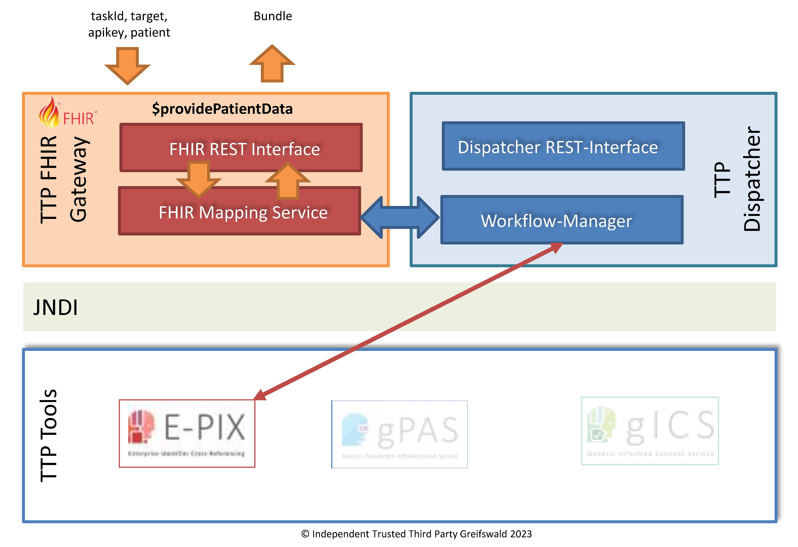

# providePatientData - v2025.2.0

  

 
 2025.2.0 - ci-build  

* [**Table of Contents**](toc.md)
* [**Artifacts Summary**](artifacts.md)
* **providePatientData**

## OperationDefinition: providePatientData 

| | |
| :--- | :--- |
| *Official URL*:https://ths-greifswald.de/fhir/OperationDefinition/dispatcher/providePatientData | *Version*:2025.2.0 |
| Active as of 2026-02-18 | *Computable Name*:ProvidePatientData |

 
Identifizierende Daten (IDAT) werden für einen Clearing-Prozess an die föderierte Treuhandstelle (fTTP) übertragen. Die darin enthaltenen Attribute (z.B. Vorname, Nachname, usw.) dienen für ein konventionelles Record Linkage und werden danach in der fTTP unwiederbringlich gelöscht. 

## Zweck

Identifizierende Daten (IDAT) werden für einen Clearing-Prozess an die fTTP übertragen. Die darin enthaltenen Attribute (z.B. Vorname, Nachname, usw.) dienen für ein konventionelles Record Linkage und werden danach in der fTTP unwiederbringlich gelöscht.

  

## Voraussetzung

* API-Key: Der spezifizierte API-Key muss valide und zum Aufruf der Methode autorisiert sein. Der API-KEY wird im Request-Header übermittelt.
* Die übermittelten IDAT müssen valide sein.
* Die TaskId muss valide sein.
* Der Standort hat zuvor seine Tasks abgerufen (vgl. requestTasks) und eine Aufgabe "send-idat" zugewiesen bekommen haben.

## Aufruf und Rückgabe

Die bereitgestellte Funktionalität kann per POST-Request aufgerufen werden. Die erforderlichen Angaben werden per POST-BODY in Form von [FHIR Parameters](https://www.hl7.org/fhir/parameters.html) übermittelt.

`<HOST>:<PORT>/ttp-fhir/fhir/dispatcher/$providePatientData`

Der Funktionsaufruf liefert eine Parameters-Ressource bestehend aus multiplen Multi-Part-Parametern zurück.

Der Parameter "patient" enthält eine Patient-Ressource entsprechend dem [IDAT-Profil](StructureDefinition-Idat.md).

Im Erfolgsfall wird der HTTP Statuscode 200 zurückgegeben.

Im Fehlerfall wird einer der folgenden HTTP Statuscodes in Verbindung mit einer OperationOutcome-Ressource zurückgegeben:

* 400: Fehlende oder fehlerhafte Parameter.
* 401: Fehlende Authentifizierung oder Autorisierung.
* 404: Parameter mit unbekanntem Inhalt.
* 422: Fehlende oder falsche Patienten-Attribute.

## Beispiel

* [Request-Body](Parameters-Parameters-ProvidePatientData-request-example-1.md)


## Resource Content

```json
{
  "resourceType" : "OperationDefinition",
  "id" : "ProvidePatientData",
  "url" : "https://ths-greifswald.de/fhir/OperationDefinition/dispatcher/providePatientData",
  "version" : "2025.2.0",
  "name" : "ProvidePatientData",
  "title" : "providePatientData",
  "status" : "active",
  "kind" : "operation",
  "date" : "2026-02-18",
  "publisher" : "Unabhängige Treuhandstelle der Universitätsmedizin Greifswald",
  "contact" : [{
    "name" : "Unabhängige Treuhandstelle der Universitätsmedizin Greifswald",
    "telecom" : [{
      "system" : "url",
      "value" : "https://www.ths-greifswald.de/"
    }]
  }],
  "description" : "Identifizierende Daten (IDAT) werden für einen Clearing-Prozess an die föderierte Treuhandstelle (fTTP) übertragen. Die darin enthaltenen Attribute (z.B. Vorname, Nachname, usw.) dienen für ein konventionelles Record Linkage und werden danach in der fTTP unwiederbringlich gelöscht.",
  "affectsState" : true,
  "code" : "providePatientData",
  "comment" : "Identifizierende Daten (IDAT) werden für einen Clearing-Prozess an die föderierte Treuhandstelle (fTTP) übertragen. Die darin enthaltenen Attribute (z.B. Vorname, Nachname, usw.) dienen für ein konventionelles Record Linkage und werden danach in der fTTP unwiederbringlich gelöscht.",
  "system" : true,
  "type" : false,
  "instance" : false,
  "parameter" : [{
    "name" : "taskId",
    "use" : "in",
    "min" : 1,
    "max" : "1",
    "documentation" : "Identifikator der Aufgabe; Rückreferenzierung auf die aus der providePatientData Operation erhaltene Aufgabe.",
    "type" : "id"
  },
  {
    "name" : "target",
    "use" : "in",
    "min" : 1,
    "max" : "1",
    "documentation" : "Angabe der Ziel-Domäne bzw. des abrufenden Standorts",
    "type" : "string"
  },
  {
    "name" : "patient",
    "use" : "in",
    "min" : 1,
    "max" : "1",
    "documentation" : "Patient-Ressource die, soweit bekannt, die in der der taskId assoziierten Aufgabe definierten identifizierenden Datenelemente eines Patienten enthält.",
    "type" : "Patient"
  },
  {
    "name" : "return",
    "use" : "out",
    "min" : 0,
    "max" : "1",
    "documentation" : "Bundle mit den beschriebenen Inhalten",
    "type" : "Bundle"
  }]
}

```
