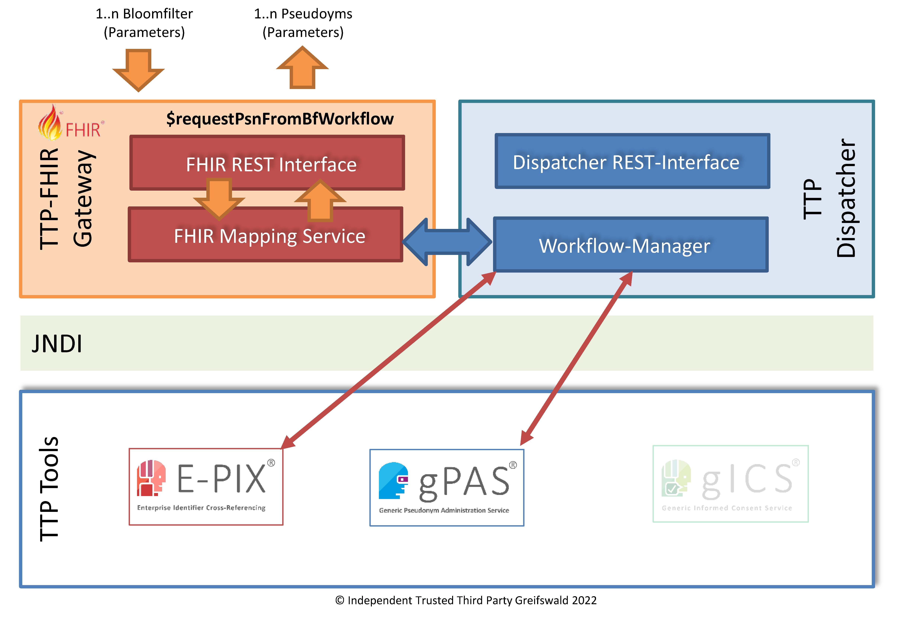

# requestPsnFromBfWorkflow - v2025.2.0

  

 
 2025.2.0 - ci-build  

* [**Table of Contents**](toc.md)
* [**Artifacts Summary**](artifacts.md)
* **requestPsnFromBfWorkflow**

## OperationDefinition: requestPsnFromBfWorkflow 

| | |
| :--- | :--- |
| *Official URL*:https://ths-greifswald.de/fhir/OperationDefinition/dispatcher/requestPsnFromBfWorkflow | *Version*:2025.2.0 |
| Active as of 2026-02-18 | *Computable Name*:RequestPsnFromBfWorkflow |

 
Personenregistrierung und Privacy-Preserving Record Linkage (PPRL) auf Basis von Bloomfiltern (BF) innerhalb eines Geltungsbereiches (Studie, Standort). Die Erzeugung eines standortspezifischen Pseudonyms erfolgt innerhalb der angegebenen Ziel-Domäne. Diese wird automatisch erzeugt, sofern noch nicht vorhanden. Die Rückgabe eines standortspezifischen Pseudonyms (z.B. DIZPseudonym) erfolgt als Parameter. 

## Zweck

Anlegen und Matching von Patienten rein auf Basis von Bloomfiltern (PPRL) für einen gegebenen Geltungsbereich (Studie und Standort). Rückgabe der generierten Pseudonyme (z.b. DIC-PSN(s)) als Parameter.

  

## Voraussetzung

* API-Key: Der spezifizierte API-Key muss valide und zum Aufruf der Methode autorisiert sein. Der API-KEY wird im Request-Header übermittelt.
* Die spezifizierte Studie muss im Zielsystem bekannt und angelegt sein.
* Die übermittelten Bloomfilter müssen valide sein.
* Die standortspezifische Domäne (target) muss im Zielsystem bekannt und angelegt sein.

## Aufruf und Rückgabe

Die bereitgestellte Funktionalität kann per POST-Request aufgerufen werden. Die erforderlichen Angaben werden per POST-BODY in Form von [FHIR Parameters](https://www.hl7.org/fhir/parameters.html) übermittelt.

`<HOST>:<PORT>/ttp-fhir/fhir/dispatcher/$requestPsnFromBfWorkflow`

Der Funktionsaufruf liefert eine Parameters-Ressource bestehend aus multiplen Multi-Part-Parametern zurück.

Im Erfolgsfall wird der HTTP Statuscode 200 zurückgegeben.

Wenn einzelne übergebene Parameter fehlerhaft bzw. nicht valide sind, wird statt eines Pseudonyms ein Fehler-Parameter (error-Parameter) mit der Fehlerbeschreibung zurückgeliefert.

Ist der Request gänzlich ungültig, wird einer der folgenden HTTP Statuscodes in Verbindung mit einer OperationOutcome-Ressource zurückgegeben:

* 400: Fehlende oder fehlerhafte Parameter.
* 401: Fehlende Authentifizierung oder Autorisierung.
* 404: Parameter mit unbekanntem Inhalt.
* 422: Fehlende oder falsche Patienten-Attribute.

## Hinweis zu zukünftigen Änderungen

Das Pseudonym wird künftig nur dann geliefert, wenn kein Clearing-Prozess angestoßen wird. Ist dieser erforderlich, muss dieser zunächst vollständig abgeschlossen sein und das Pseudonym kann über [die Operation $requestTasks](OperationDefinition-RequestTasks.md) abgerufen werden.

## Beispiel

* [Request-Body](Parameters-Parameters-RequestPsnFromBfWorkflow-request-example-1.md)
* [Rückmeldung](Parameters-Parameters-RequestPsnFromBfWorkflow-response-example-1.md)


## Resource Content

```json
{
  "resourceType" : "OperationDefinition",
  "id" : "RequestPsnFromBfWorkflow",
  "url" : "https://ths-greifswald.de/fhir/OperationDefinition/dispatcher/requestPsnFromBfWorkflow",
  "version" : "2025.2.0",
  "name" : "RequestPsnFromBfWorkflow",
  "title" : "requestPsnFromBfWorkflow",
  "status" : "active",
  "kind" : "operation",
  "date" : "2026-02-18",
  "publisher" : "Unabhängige Treuhandstelle der Universitätsmedizin Greifswald",
  "contact" : [{
    "name" : "Unabhängige Treuhandstelle der Universitätsmedizin Greifswald",
    "telecom" : [{
      "system" : "url",
      "value" : "https://www.ths-greifswald.de/"
    }]
  }],
  "description" : "Personenregistrierung und Privacy-Preserving Record Linkage (PPRL) auf Basis von Bloomfiltern (BF) innerhalb eines Geltungsbereiches (Studie, Standort). Die Erzeugung eines standortspezifischen Pseudonyms erfolgt innerhalb der angegebenen Ziel-Domäne. Diese wird automatisch erzeugt, sofern noch nicht vorhanden. Die Rückgabe eines standortspezifischen Pseudonyms (z.B. DIZPseudonym) erfolgt als Parameter.",
  "code" : "requestPsnFromBfWorkflow",
  "comment" : "Personenregistrierung und Privacy-Preserving Record Linkage (PPRL) auf Basis von Bloomfiltern (BF) innerhalb eines Geltungsbereiches (Studie, Standort). Die Erzeugung eines standortspezifischen Pseudonyms erfolgt innerhalb der angegebenen Ziel-Domäne. Diese wird automatisch erzeugt, sofern noch nicht vorhanden. Die Rückgabe eines standortspezifischen Pseudonyms (z.B. DIZPseudonym) erfolgt als Parameter.",
  "system" : true,
  "type" : false,
  "instance" : false,
  "parameter" : [{
    "name" : "study",
    "use" : "in",
    "min" : 1,
    "max" : "1",
    "documentation" : "Angabe der Studie",
    "type" : "string"
  },
  {
    "name" : "bloomfilter",
    "use" : "in",
    "min" : 1,
    "max" : "*",
    "documentation" : "Liste studien- und standortspezifischer Bloomfilter (base64-codiert)",
    "type" : "base64Binary",
    "part" : [{
      "name" : "bloomfilter",
      "use" : "out",
      "min" : 1,
      "max" : "1",
      "documentation" : "Bloomfilter"
    },
    {
      "name" : "version",
      "use" : "out",
      "min" : 1,
      "max" : "1",
      "documentation" : "Version des Bloomfilters"
    }]
  },
  {
    "name" : "target",
    "use" : "in",
    "min" : 1,
    "max" : "1",
    "documentation" : "Angabe des Bloomfilter sendenden Standorts (Ziel-Domäne)",
    "type" : "string"
  },
  {
    "name" : "pseudonym-bf",
    "use" : "out",
    "min" : 0,
    "max" : "*",
    "documentation" : "Ermitteltes bzw. generiertes studien- und standort-spezifisches Pseudonym",
    "part" : [{
      "name" : "bloomfilter",
      "use" : "out",
      "min" : 1,
      "max" : "1",
      "documentation" : "Bloomfilter",
      "type" : "base64Binary"
    },
    {
      "name" : "target",
      "use" : "out",
      "min" : 1,
      "max" : "1",
      "documentation" : "die verwendete Ziel-Domäne (im Request übergeben)",
      "type" : "Identifier"
    },
    {
      "name" : "pseudonym",
      "use" : "out",
      "min" : 1,
      "max" : "1",
      "documentation" : "das in der Ziel-Domäne erzeugte Pseudonym.",
      "type" : "Identifier"
    }]
  },
  {
    "name" : "error",
    "use" : "out",
    "min" : 0,
    "max" : "*",
    "documentation" : "Fehlerrückgabe bei Teil-Fehlern",
    "part" : [{
      "name" : "bloomfilter",
      "use" : "out",
      "min" : 0,
      "max" : "1",
      "documentation" : "Bloomfilter",
      "type" : "base64Binary"
    },
    {
      "name" : "target",
      "use" : "out",
      "min" : 0,
      "max" : "1",
      "documentation" : "die verwendete Ziel-Domäne (im Request übergeben)",
      "type" : "Identifier"
    },
    {
      "name" : "error-code",
      "use" : "out",
      "min" : 1,
      "max" : "1",
      "documentation" : "Fehlercode",
      "type" : "Coding"
    }]
  }]
}

```
