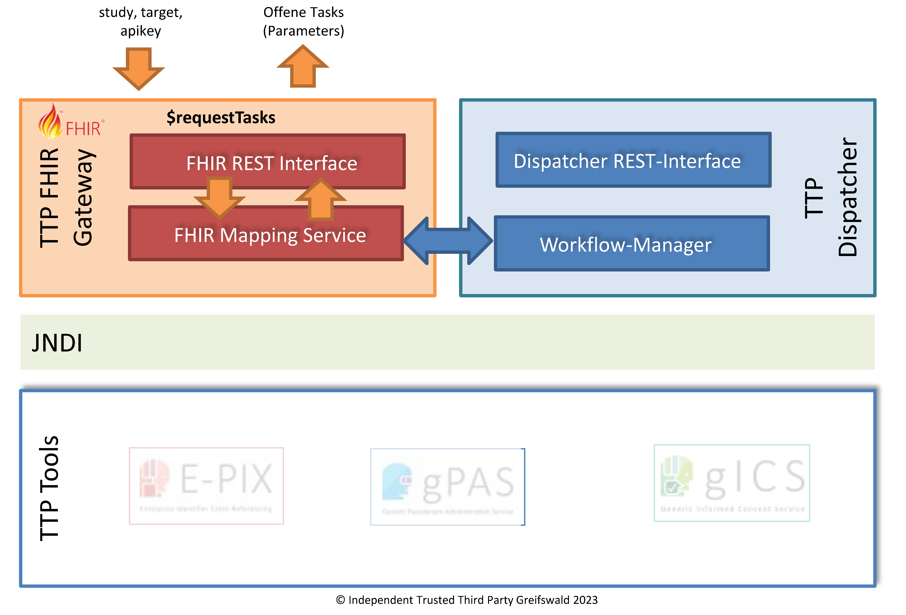

# requestTasks - v2025.2.0

  

 
 2025.2.0 - ci-build  

* [**Table of Contents**](toc.md)
* [**Artifacts Summary**](artifacts.md)
* **requestTasks**

## OperationDefinition: requestTasks 

| | |
| :--- | :--- |
| *Official URL*:https://ths-greifswald.de/fhir/OperationDefinition/dispatcher/requestTasks | *Version*:2025.2.0 |
| Active as of 2026-02-18 | *Computable Name*:RequestTasks |

 
Abruf offener Standort-Aufgaben (Tasks) von der föderierten Treuhandstelle (fTTP). 

## Zweck

Tasks sind Aufgaben, die ein Standort regelmäßig abruft und abarbeitet. Dies umfasst beispielsweise die Auflösung eines Clearing-Prozesses, wenn ein Privacy-Preserving Record Linkage zu einem uneindeutigem Ergebnis kam. Es wird empfohlen, die Aufgaben regelmäßig (und mehrmals die Woche) abzurufen. Andernfalls können uneindeutige Matches nicht aufgelöst werden und entsprechende Pseudonyme nicht vergeben werden. Aufgaben können sein: Einen vorhergehenden Request erneut senden, das Pseudonym nach einem Clearing-Prozess abrufen und am Standort hinterlegen, Identifizierende Daten zu einem vorher gesendeten Bloomfilter senden. Aufgaben haben ein Verfallsdatum. Werden diese nicht rechtzeitig abgearbeitet, wird der auslösende Prozess abgebrochen (z.B. Clearing-Prozess).

  

## Voraussetzung

* API-Key: Der spezifizierte API-Key muss valide und zum Aufruf der Methode autorisiert sein. Der API-KEY wird im Request-Header übermittelt.
* Die spezifizierte Studie muss im Zielsystem bekannt und angelegt sein.
* Die standortspezifische Ziel-Domäne (target) muss im Zielsystem bekannt und angelegt sein.

## Aufruf und Rückgabe

Die bereitgestellte Funktionalität kann per POST-Request aufgerufen werden. Die erforderlichen Angaben werden per POST-BODY in Form von [FHIR Parameters](https://www.hl7.org/fhir/parameters.html) übermittelt.

`<HOST>:<PORT>/ttp-fhir/fhir/dispatcher/$requestTasks`

Der Funktionsaufruf liefert eine Parameters-Ressource bestehend aus multiplen Multi-Part-Parametern zurück.

Im Erfolgsfall wird der HTTP Statuscode 200 zurückgegeben.

Im Fehlerfall wird einer der folgenden HTTP Statuscodes in Verbindung mit einer OperationOutcome-Ressource zurückgegeben:

* 400: Fehlende oder fehlerhafte Parameter.
* 401: Fehlende Authentifizierung oder Autorisierung.

## Beispiel

* [Request-Body](Parameters-Parameters-RequestTasks-request-example-1.md)
* [Rückmeldung](Parameters-Parameters-RequestTasks-response-example-1.md)


## Resource Content

```json
{
  "resourceType" : "OperationDefinition",
  "id" : "RequestTasks",
  "url" : "https://ths-greifswald.de/fhir/OperationDefinition/dispatcher/requestTasks",
  "version" : "2025.2.0",
  "name" : "RequestTasks",
  "title" : "requestTasks",
  "status" : "active",
  "kind" : "operation",
  "date" : "2026-02-18",
  "publisher" : "Unabhängige Treuhandstelle der Universitätsmedizin Greifswald",
  "contact" : [{
    "name" : "Unabhängige Treuhandstelle der Universitätsmedizin Greifswald",
    "telecom" : [{
      "system" : "url",
      "value" : "https://www.ths-greifswald.de/"
    }]
  }],
  "description" : "Abruf offener Standort-Aufgaben (Tasks) von der föderierten Treuhandstelle (fTTP).",
  "affectsState" : false,
  "code" : "requestTasks",
  "comment" : "Ein Standort kann seine offenen Aufgaben abrufen. Antwort ist eine Liste von Tasks.",
  "system" : true,
  "type" : false,
  "instance" : false,
  "parameter" : [{
    "name" : "study",
    "use" : "in",
    "min" : 1,
    "max" : "1",
    "documentation" : "Angabe der Studie",
    "type" : "string"
  },
  {
    "name" : "target",
    "use" : "in",
    "min" : 1,
    "max" : "1",
    "documentation" : "Angabe der Ziel-Domäne bzw. des abrufenden Standorts",
    "type" : "string"
  },
  {
    "name" : "dic_psn_available",
    "use" : "out",
    "min" : 0,
    "max" : "*",
    "documentation" : "Pseudonym-Rückgabe aus einem Bloomfilter-Request.",
    "part" : [{
      "name" : "expires",
      "use" : "out",
      "min" : 0,
      "max" : "1",
      "documentation" : "Ablaufdatum (danach ist die Information ungültig)",
      "type" : "instant"
    },
    {
      "name" : "bloomfilter",
      "use" : "out",
      "min" : 1,
      "max" : "1",
      "documentation" : "Bloomfilter",
      "type" : "base64Binary"
    },
    {
      "name" : "target",
      "use" : "out",
      "min" : 1,
      "max" : "1",
      "documentation" : "Target-Identifikator",
      "type" : "Identifier"
    },
    {
      "name" : "pseudonym",
      "use" : "out",
      "min" : 1,
      "max" : "1",
      "documentation" : "Pseudonym",
      "type" : "Identifier"
    }]
  },
  {
    "name" : "send_idat",
    "use" : "out",
    "min" : 0,
    "max" : "*",
    "documentation" : "Anforderung, IDAT zu übermitteln.",
    "part" : [{
      "name" : "expires",
      "use" : "out",
      "min" : 1,
      "max" : "1",
      "documentation" : "Ablaufdatum (danach ist die Information ungültig)",
      "type" : "instant"
    },
    {
      "name" : "taskId",
      "use" : "out",
      "min" : 1,
      "max" : "1",
      "documentation" : "Identifikator der Aufgabe, dient der Rückreferenzierung in der providePatientData Operation.",
      "type" : "id"
    },
    {
      "name" : "pseudonym",
      "use" : "out",
      "min" : 0,
      "max" : "1",
      "documentation" : "Pseudonym. Entweder Pseudonym oder Bloomfilter müssen enthalten sein.",
      "type" : "Identifier"
    },
    {
      "name" : "bloomfilter",
      "use" : "out",
      "min" : 0,
      "max" : "1",
      "documentation" : "Bloomfilter. Entweder Pseudonym oder Bloomfilter müssen enthalten sein.",
      "type" : "base64Binary"
    },
    {
      "name" : "element",
      "use" : "out",
      "min" : 1,
      "max" : "*",
      "documentation" : "Vorgabe, welche Elemente in den IDAT von providePatientData enthalten sein sollen. Das Coding ist an das Value Set IdatElements gebunden.",
      "type" : "Coding",
      "binding" : {
        "strength" : "required",
        "valueSet" : "https://ths-greifswald.de/fhir/ValueSet/dispatcher/IdatElements"
      }
    }]
  },
  {
    "name" : "repeat_request",
    "use" : "out",
    "min" : 0,
    "max" : "*",
    "documentation" : "Anforderung einen Bloomfilter-Request zu wiederholen.",
    "part" : [{
      "name" : "expires",
      "use" : "out",
      "min" : 0,
      "max" : "1",
      "documentation" : "Ablaufdatum (danach ist die Information ungültig)",
      "type" : "instant"
    },
    {
      "name" : "study",
      "use" : "out",
      "min" : 1,
      "max" : "1",
      "documentation" : "Angabe der Studie",
      "type" : "Identifier"
    },
    {
      "name" : "bloomfilter",
      "use" : "out",
      "min" : 1,
      "max" : "1",
      "documentation" : "Studien- und standortspezifischer Bloomfilter (base64-codiert)",
      "type" : "base64Binary"
    },
    {
      "name" : "target",
      "use" : "out",
      "min" : 1,
      "max" : "1",
      "documentation" : "Angabe des Bloomfilter sendenden Standorts (Ziel-Domäne)",
      "type" : "Identifier"
    }]
  }]
}

```
