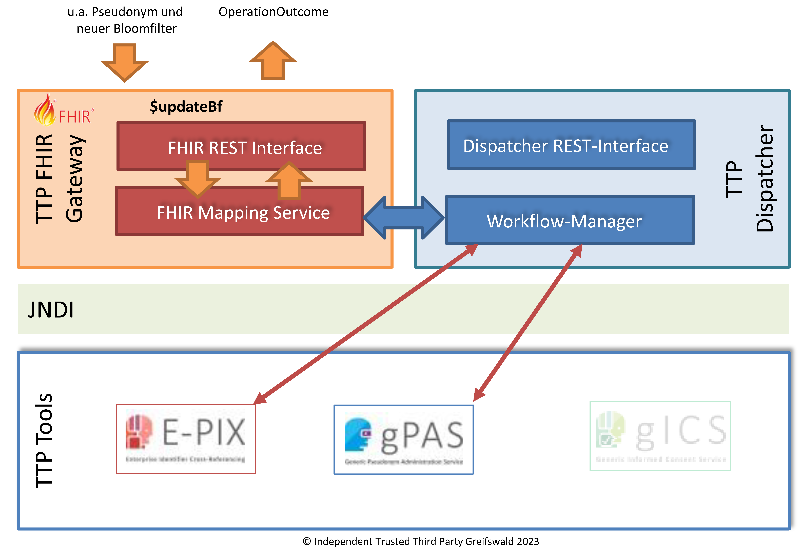

# updateBf - v2025.2.0

  

 
 2025.2.0 - ci-build  

* [**Table of Contents**](toc.md)
* [**Artifacts Summary**](artifacts.md)
* **updateBf**

## OperationDefinition: updateBf 

| | |
| :--- | :--- |
| *Official URL*:https://ths-greifswald.de/fhir/OperationDefinition/dispatcher/UpdateBf | *Version*:2025.2.0 |
| Draft as of 2026-02-18 | *Computable Name*:UpdateBf |

 
Aktualisierung eines bestehenden Bloomfilters (z.B. bei geänderter Konfiguration oder vorheriger fehlerhafter Übermittlung) bezogen auf ein bereits bekanntes Pseudonym. 

## Zweck

Aktualisierung eines bestehenden Bloomfilters (z.B. bei geänderter Konfiguration oder vorheriger fehlerhafter Übermittlung) bezogen auf ein bereits bekanntes Pseudonym.

  

## Voraussetzung

* API-Key: Der spezifizierte API-Key muss valide und zum Aufruf der Methode autorisiert sein. Der API-KEY wird im Request-Header übermittelt.
* Die spezifizierte Studie (study) muss im Zielsystem bekannt und angelegt sein.
* Die spezifizierte Quell-Domäne (source) muss im Zielsystem bekannt und angelegt sein.
* Das spezifizierte Pseudonym (pseudonym) muss im Zielsystem bekannt und angelegt sein.

## Aufruf und Rückgabe

Die bereitgestellte Funktionalität kann per POST-Request aufgerufen werden. Die erforderlichen Angaben werden per POST-BODY in Form von [FHIR Parameters](https://www.hl7.org/fhir/parameters.html) übermittelt.

`<HOST>:<PORT>/ttp-fhir/fhir/dispatcher/$updateBf`

Der Funktionsaufruf liefert eine OperationOutcome-Ressource mit codierter Statusinformationen zurück.

Im Erfolgsfall wird der HTTP Statuscode 200 zurückgegeben.

Im vollständigen Fehlerfall wird einer der folgenden HTTP Statuscodes in Verbindung mit einer OperationOutcome-Ressource zurückgegeben:

* 400: Fehlende oder fehlerhafte Parameter.
* 401: Fehlende Authentifizierung oder Autorisierung.
* 404: Parameter mit unbekanntem Inhalt.
* 422: Fehlende oder falsche Patienten-Attribute.

## Beispiel

* [Request-Body](Parameters-Parameters-UpdateBf-request-example-1.md)
* [Rückmeldung](OperationOutcome-OperationOutcome-UpdateBf-response-example-1.md)


## Resource Content

```json
{
  "resourceType" : "OperationDefinition",
  "id" : "UpdateBf",
  "url" : "https://ths-greifswald.de/fhir/OperationDefinition/dispatcher/UpdateBf",
  "version" : "2025.2.0",
  "name" : "UpdateBf",
  "title" : "updateBf",
  "status" : "draft",
  "kind" : "operation",
  "date" : "2026-02-18",
  "publisher" : "Unabhängige Treuhandstelle der Universitätsmedizin Greifswald",
  "contact" : [{
    "name" : "Unabhängige Treuhandstelle der Universitätsmedizin Greifswald",
    "telecom" : [{
      "system" : "url",
      "value" : "https://www.ths-greifswald.de/"
    }]
  }],
  "description" : "Aktualisierung eines bestehenden Bloomfilters (z.B. bei geänderter Konfiguration oder vorheriger fehlerhafter Übermittlung) bezogen auf ein bereits bekanntes Pseudonym.",
  "affectsState" : true,
  "code" : "updateBf",
  "system" : true,
  "type" : false,
  "instance" : false,
  "parameter" : [{
    "name" : "study",
    "use" : "in",
    "min" : 1,
    "max" : "1",
    "documentation" : "Angabe der Studie",
    "type" : "string"
  },
  {
    "name" : "bloomfilter",
    "use" : "in",
    "min" : 1,
    "max" : "1",
    "documentation" : "der hinzu zu fügende Bloomfilter (base64-codiert)",
    "type" : "base64Binary"
  },
  {
    "name" : "source",
    "use" : "in",
    "min" : 1,
    "max" : "1",
    "documentation" : "Angabe des Bloomfilter sendenden Standorts (Quell-Domäne)",
    "type" : "string"
  },
  {
    "name" : "pseudonym",
    "use" : "in",
    "min" : 1,
    "max" : "1",
    "documentation" : "Das Pseudonym, dessen Bloomfilter aktualisiert werden soll.",
    "type" : "string"
  },
  {
    "name" : "bfVersion",
    "use" : "in",
    "min" : 1,
    "max" : "1",
    "documentation" : "Bloomfilter-Version.",
    "type" : "string"
  },
  {
    "name" : "return",
    "use" : "out",
    "min" : 1,
    "max" : "1",
    "documentation" : "Rückinformation.",
    "type" : "OperationOutcome"
  }]
}

```
